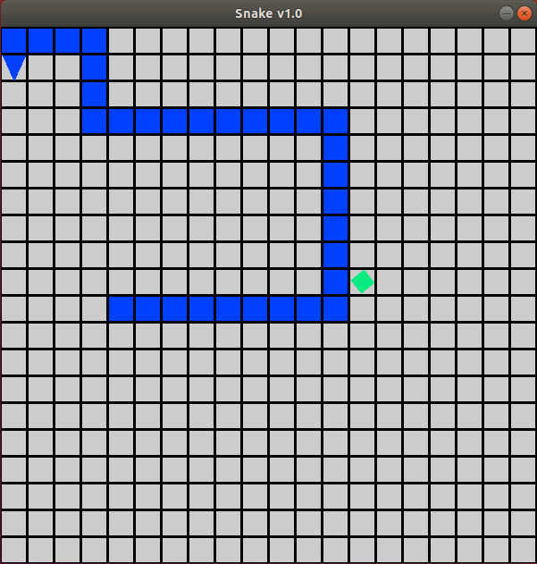
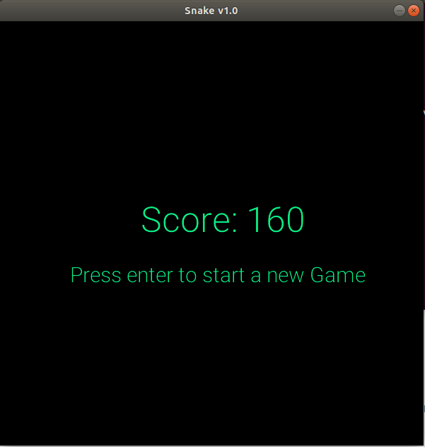

# Snake v1.0
<p float="left">
  
  
</p>

Snake is a simple 2D game written in the programming language CX.

## What is CX?
CX is a general purpose, interpreted and compiled programming language, with a very strict type system and a syntax similar to Golang's. CX provides a new programming paradigm based on the concept of affordances, where the user can ask the programming language at runtime what can be done with a CX object (functions, expressions, packages, etc.), and interactively or automatically choose one of the affordances to be applied.

You can find more info on:

The github page on CX - https://github.com/skycoin/cx <br/>
The official website of Skycoin - https://www.skycoin.net/

## Installation
Snake requires the latest version of [CX](https://github.com/skycoin/cx) to run.

Install the dependencies and devDependencies and start the server. After installing [CX](https://github.com/skycoin/cx) and all its dependencies clone this repository by running:
```
$ git clone https://github.com/Lunier/Snake.git
```
Wait for the cloning process to finish and navigate to the cloned directory...
```
$ cd Snake/
```
The game should be ready to run.

## Running the game
In order to run the game type the following command:
```
$ cx stuff.cx snake.cx
```
Use the arrows to move the player and try to eat the food, while not eating yourself.

## To Do...
The code is currently very disorganized due to the fact that this was my first experience with CX and I had to play around some bugs. I will make sure to clean things up as soon as possible.

* Refactor code
* Figure out how to use sprites
* Ask the community for feedback/features

## Contribute
If you want to show your appreciation for my work fell free to send a contribution in Skycoin to the address below. <br/>
Also if you have any ideas to improve the game, please share them with me.

Skycoin Address: shAih4RfkkS9yKF2ULouWdE6pfXdikb6i6<br/>
Thank you Skycoin community!

## Disclamer
I am not part of the team responsible for the development of the CX programming language neither do I claim some sort of affiliation with the Skycoin Project.
