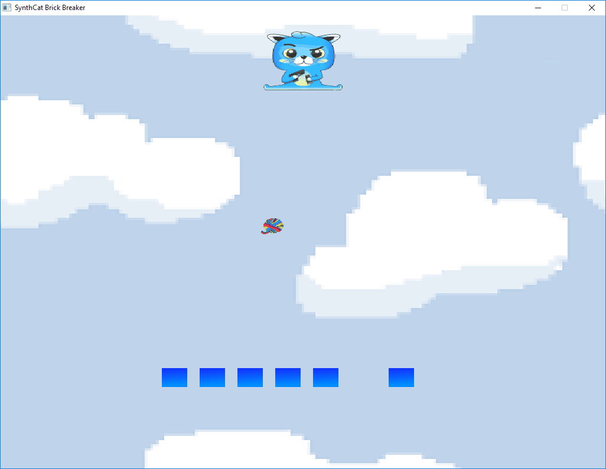

# SynthCat Brick Breaker!

SynthCat Brick Breaker is a game where you knock a ball of yarn to break bricks as SynthCat.
<p float="left">
  
</p>

# What is CX?
CX is a general purpose, interpreted and compiled programming language, with a very strict type system and a syntax similar to Golang's. CX provides a new programming paradigm based on the concept of affordances, where the user can ask the programming language at runtime what can be done with a CX object (functions, expressions, packages, etc.), and interactively or automatically choose one of the affordances to be applied.

You can find more info on:
  - The github page on CX - https://github.com/skycoin/cx
  - The official website of Skycoin - https://www.skycoin.net/

# Installation
SynthCat Brick Breaker requires the latest version of [CX](https://github.com/skycoin/cx) to run.

After installing [CX](https://github.com/skycoin/cx) and all its dependencies clone this repository by running:

```sh
$ git clone https://github.com/redcurse/SynthCat-Brick-Breaker.git
```

Wait for the cloning process to finish and navigate to the cloned directory...

```sh
$ cd SynthCat-Brick-Breaker/
```

The game should be ready to run.

# Running the game
In order to run the game type the following command:

```sh
$ cx loop_tracker.cx loop_limiter.cx main.cx
```

Control SynthCat by pressing left and right on your keyboard.

# Contribute
If you want to show your appreciation for my work fell free to send a contribution in Skycoin
to the address below and/or dm me some kind words on [telegram](https://t.me/redcurse).
  - Skycoin Address: EBqmtuEyK6z4BgmjFoXPiSas1dydxdPqAf

Thank you Skycoin community!

## Disclamer
I am not part of the team responsible for the development of the CX programming language neither do I claim some sort of affiliation with the Skycoin Project.
